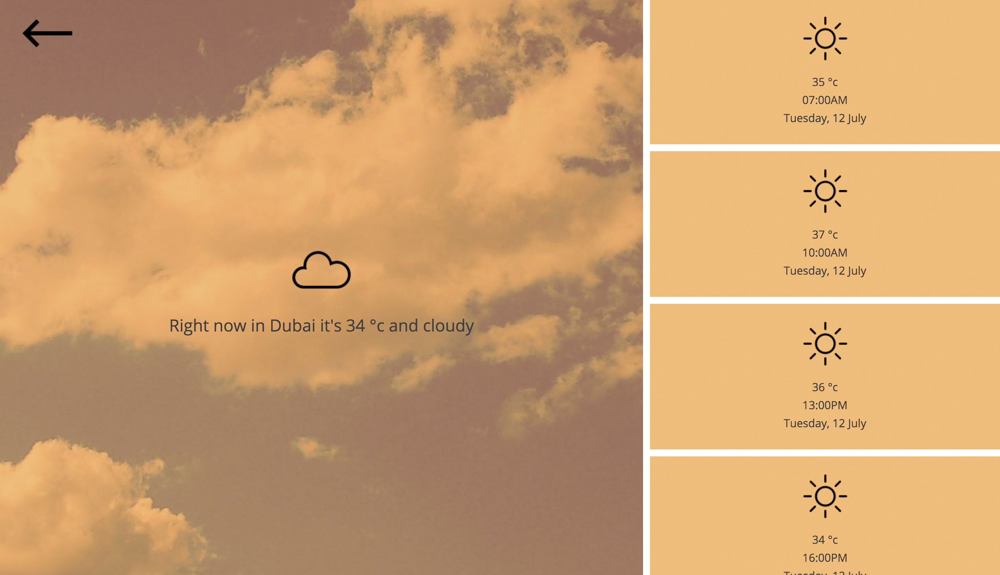

Weather rainbow
=====================

Weather rainbow is a simple application using AngularJS that visually shows you the weather temperature using colours as well as numbers. This is just a fun little project to see whether we visualise and understand the temperature better using a colour than if we had just read the temperature.

### How to run

1. `git clone` repo
2. `npm install` to get the node_modules
3.  `cd` to the folder and then `http-server ./` will open up [localhost:8080/](http://localhost:8080/)

Weather rainbow gets its live data from the [open weather map](http://openweathermap.org/api).

### Bugs

A few locations retrieve the wrong location data. An example is if you select 'New Dehli', you get 'Connaught Place'. I am slowly working through these and matching them up correctly...
